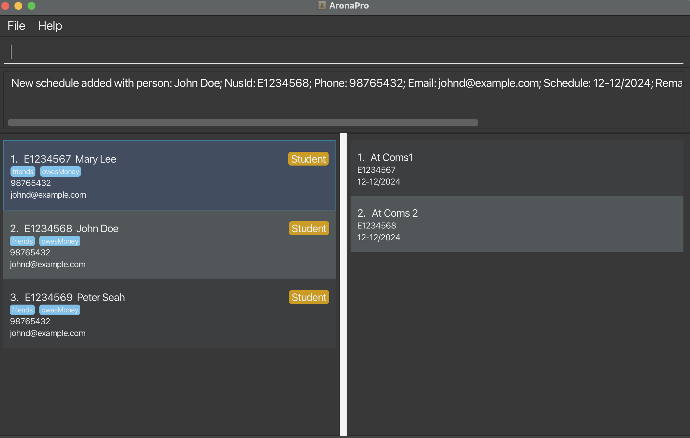
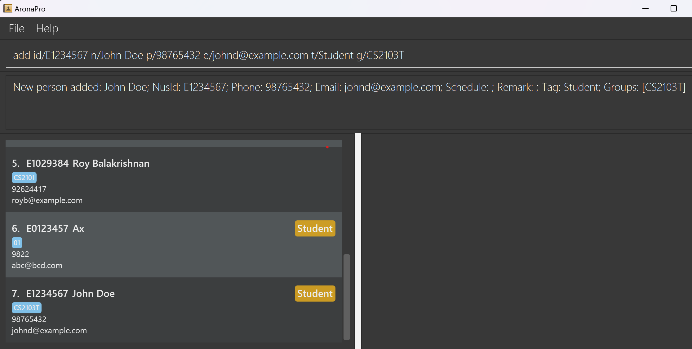
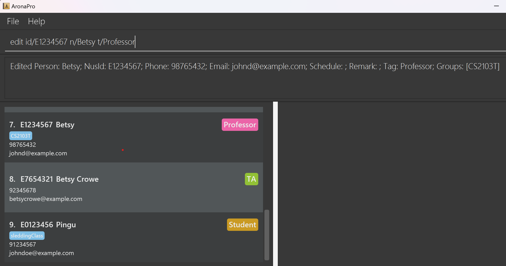
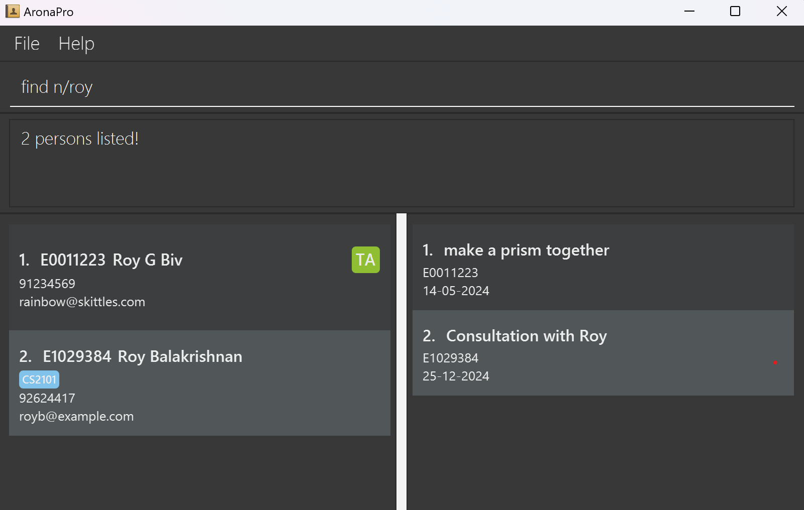
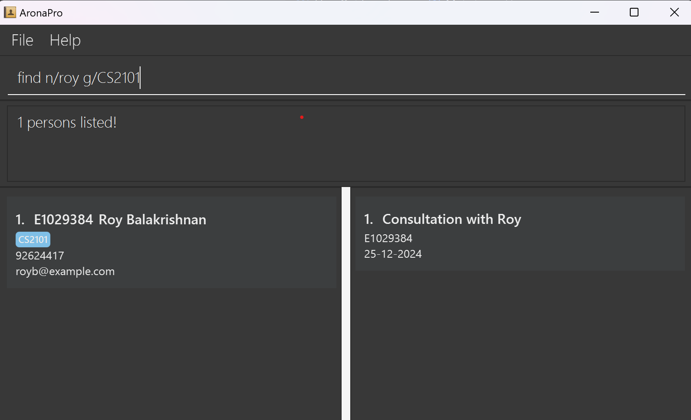
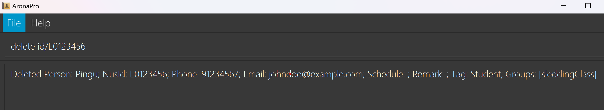
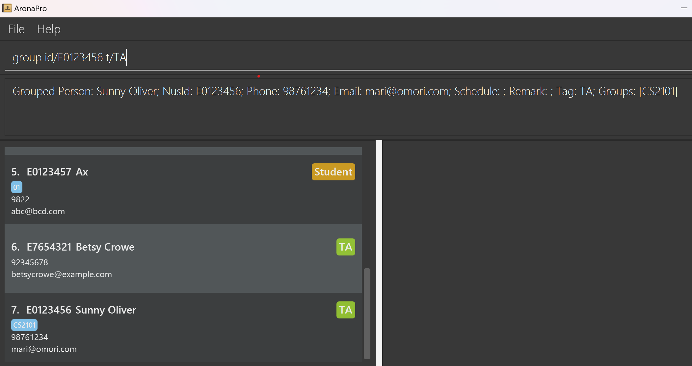
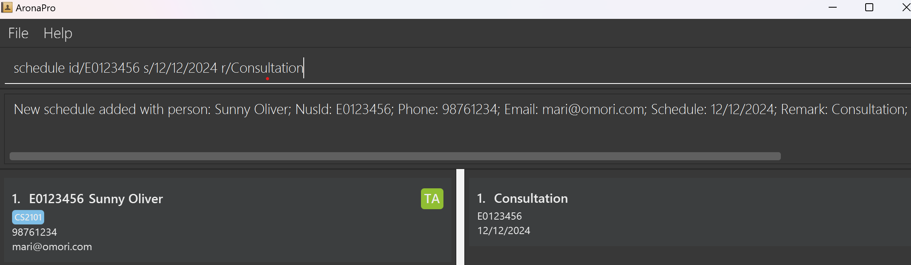
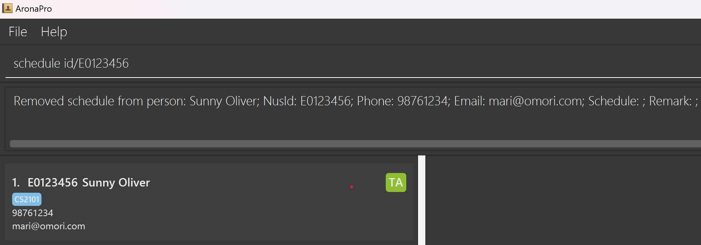
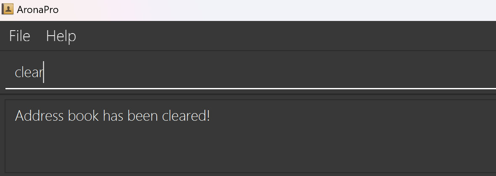

# About AronaPro

--------------------------------------------------------------------------------------------------------------------

Welcome to AronaPro's User Guide, and thank you for choosing us as your all-in-one solution! 
Our product is a desktop app designed primarily for **Computing Professors and Teaching Assistants(TAs)** to manage your 
students/professors/TAs' contacts and schedules efficiently, optimised for use via a Command Line Interface (CLI) 
while still having the benefits of a Graphical User Interface (GUI). Our simple-to-grasp software also warmly welcomes
professors and TAs from various faculties without any technological background! 

We are excited to have you on board and to guide you through how to use our software with this guide.

Together, let's **_Centralise_, _Connect_ and _Coordinate_!**

<!-- * Table of Contents -->
<page-nav-print />

--------------------------------------------------------------------------------------------------------------------

## Quick start

1. Ensure you have Java `11` or above installed in your Computer.

1. Download the latest `aronapro.jar` [here](https://github.com/AY2324S2-CS2103T-T15-2/tp/releases). 

1. Copy the file to the folder you want to use as the _home folder_ for AronaPro in your desired location. For demonstration purpose, we will save the downloaded jar file into `test` folder and saved it to `Desktop` on either Mac or Windows machines. 

1. Open a command terminal, either by typing `terminal` on Mac or `PowerShell` on windows and perform the following steps to reach the `test` folder created earlier in order to run the application:
   1. First type `ls` to see what are all the folders in your current directory.
   2. Type `cd <file_name>` where the file name refers to the file name you are trying to enter. One tip is that file name can be auto-completed simply by typing the first few words and hitting `Tab`.
   3. Repeat i. and ii. above until you see the `test` folder and `cd` into it as show in the sequence of diagrams for both Mac and Windows machines below:
   

    
   

   

    
   
 

   

    
   
  
   
1. Lastly, enter the `java -jar aronapro.jar` command to run the application. 
   A GUI similar to the below should appear in a few seconds. 
   

    
   

   e.g. typing **`help`** and pressing Enter will open the help window. 
   Some example commands you can try to quickly get started with our application:

   * `view` : Lists all contacts.

   * `add id/E1234567 n/John Doe p/98765432 e/johnd@example.com t/Student g/CS2103T-T15` : Adds a student with `NAME` John Doe with `NUSID` of E1234567 to the Address Book.

   * `delete id/E1234567` : Deletes the person with `NUSID` of E1234567.

   * `clear` : Deletes all contacts.

   * `exit` : Exits the app.

1. Refer to the [Features](#features) below for details of each command.

Click [here](#Table of Contents) to return back to the table of content 

--------------------------------------------------------------------------------------------------------------------

## Features

### **Notes about the command format:** 

* Words in `UPPER_CASE` are the parameters to be supplied by the user. 
  > `add id/NUSID n/NAME`, `NAME` is a parameter which can be used.

* Items in square brackets are optional. 
  > `n/NAME [t/TAG]` can be used as `n/John Doe t/friend` or simply as `n/John Doe`.

* Items with `…`​ after them can be used multiple times including zero times. 
  > `[g/GROUP]…​` can be used as ` ` (i.e. 0 times), `g/School`, `g/Family` etc.

* Parameters can be in any order. 
  > if the command specifies `n/NAME p/PHONE_NUMBER`, `p/PHONE_NUMBER n/NAME` is also acceptable.

* Extraneous parameters for commands that do not take in parameters (such as `help`, `view`, `exit` and `clear`) will be ignored. 
  > if the command specifies `help 123`, it will be interpreted as `help`.

* If you are using a PDF version of this document, be careful when copying and pasting commands that span multiple lines as space characters surrounding line-breaks may be omitted when copied over to the application.
</box>

### Viewing help : `help`

Shows a message explaining how to access the help page.

Format: `help`

### Adding a person: `add`

Adds a person to the address book.

Format: `add id/NUSID n/NAME p/PHONE_NUMBER e/EMAIL t/TAG [g/GROUP]…​`

> Note:
> * The `NUSID` **must be a 7-digit number following an 'E'**.

**Tip:** A person can have 0 or more groups.

Examples:
* `add id/E1234567 n/John Doe p/98765432 e/johnd@example.com t/Student g/CS2103T`
  > This command would add a person with `NUSID` of E1234567, `NAME` of John Doe, `PHONE_NUMBER` of 98765432, `EMAIL` of johnd@example.com
    `TAG` of Student, `GROUP` of CS2103T-T15 into the address book.
  >
  > 
* `add id/E7654321 n/Betsy Crowe t/TA e/betsycrowe@example.com p/92345678`
  > This command would add a person with `NUSID` of E7654321, `NAME` of Betsy Crowe, `TAG` of TA,
    `EMAIL` of betsycrowe@example.com, `PHONE_NUMBER` of 92345678 into the address book.
  > 
  > 

### Viewing all persons : `view`

Shows the entire list of persons in the address book.

Format: `view`

### Editing a person's information : `edit`

Edits the information of a person of a specified `NUSID` in the address book.

Format: `edit id/NUSID [n/NAME] [p/PHONE_NUMBER] [e/EMAIL] [t/TAG] [g/GROUP]` 

> Note:
> * The `NUSID` refers to the NUSID shown in the displayed person list.
> * The `NUSID` **must be a 7-digit number following an 'E'**.
> * > * `NAME` can consist of numbers.
> * `PHONE_NUMBER` has to be 3-10 digits long.
> * When editing tags, the valid forms have to be either 1 of these:  Professor, TA, Student, None.
> * At least one of the optional fields must be provided.
> * Existing values will be replaced by and updated to the new input values.
> * Attempt to edit a person with `NUSID` not in the address book would result in an error message.

Examples:
*  `edit id/E0123456 p/91234567 e/johndoe@example.com` 
   > This command would edit the phone number and email address of the person with `NUSID` E0123456 to be `91234567` and `johndoe@example.com` respectively.
   >
   > 
*  `edit id/E1234567 n/Betsy t/Professor` 
   > This command would edit the name and the tag of the person with `NUSID` E1234567 to be `Betsy` and `Professor` respectively.
   >
   > 

### Locating persons by name: `find`

Finds persons whose names contain any of the given keywords.

Format: `find [id/NUSID] [n/NAME] [p/PHONE] [e/EMAIL] [t/TAG] [g/GROUP] [g/MORE GROUPS]`

> Note:
> * The NUSID search matches people that has a prefix that STARTS WITH the query (e.g `E0123` fetches `E0123456`)
> * The NAME search is case-insensitive. e.g `hans` will match `Hans`
> * The order of NAME keywords does not matter. e.g. `Hans Bo` will match `Bo Hans`
> * Only full words will be matched for NAME e.g. `Han` will not match `Hans`
> * Persons matching ANY word will be selected for NAME (e.g. `Hans Bo` will fetch `Hans Gruber`, `Bo Yang`)
> * The PHONE search matches people that has a number that STARTS WITH the query (e.g `9123` fetches `91237654`)
> * The EMAIL search uses a PARTIAL, case-insensitive match. (e.g. `charles` matches `PrinceCharles@kingston.com`)
> * The TAG search uses an EXACT case-sensitive match. 
> * The GROUP search fetches people with ALL specified groups (e.g `g/CS2101 g/CS2103T` matches a person who minimally has BOTH these Groups)
> * Persons matching all parameters will be returned (i.e. `AND` search).
  
Examples:
* `find n/roy` 
  > This command would return `Roy G Biv` and `Roy Balakrishnan`. 
  > 
  > 
* `find n/roy g/CS2101`
  > This command would return `Roy Balakrishnan` who is the only person matching both the 2 conditions.
  > 
  > 

### Deleting a person : `delete`

Deletes person of a specified `NUSID` from the address book.

Format 1: `delete id/NUSID`

> Note:
> * Deletes the person of a specified `NUSID`.
> * The `NUSID` refers to the NUSID shown in the displayed person list.
> * The `NUSID` **must be a 7-digit number following an 'E'**.

Examples:
* `delete id/E0123456` 
  > This commmand will delete an existing person with `NUSID` of "E0123456".
  >
  >  

Format 2: `delete g/group`

> Note:
> * Deletes the person in a specified `group`.
> * The group refers to the group shown in the displayed person list.
> * The group **must exist in the address book beforehand**.

Examples:
* `delete g/CS2103T`
  > This command will delete an existing person with `group` of "CS2013-T15".
  > 
  > 

### Assigning a person to a group : `group`

Assigns either a group or a tag to a person of a specified `NUSID` from the address book.

Format: `group [id/NUSID] [g/GROUP] [t/TAG]`

> Note:
> * Groups the person of a specified `NUSID`.
> * The `NUSID` refers to the NUSID shown in the displayed person list.
> * The `NUSID` **must be a 7-digit number following an 'E'**
> * At least one of the optional fields must be provided.
> * When editing tags, the valid forms have to be either 1 of these:  Professor, TA, Student, None

* `group id/E0123456 g/CS2101`
  > This command will assign or change a group of the person with `NUSID` E0123456 to 'CS2101'.
  >
  > 
* `group id/E0123456 t/TA` 
  > This command will assign or change the tag of the person with `NUSID` E0123456 to 'TA'.
  > 

### Schedule a meeting with a person: `schedule`

Schedule a meeting with a person in the address book.

Format: `schedule id/NUSID [s/SCHEDULE r/REMARK]`

> Note: 
> * Schedule a meeting with a person of the specified `nusId` on the specified `schedule` with a `remark`.
> * The `NUSID` refers to the NUSID shown in the displayed person list.
> * The `NUSID` **must be a 7-digit number following an 'E'**.
> * Both `schedule` and `remark` must be either provided or not provided.
> * If `schedule` and `remark` are not provided, the schedule will be removed.

**Tip:** The `schedule` must be in one of the formats: `DD/MM/YYYY`, `DD-MM-YYYY`, `DD.MM.YYYY`, `MMM DD, YYYY`, `DD MMM YYYY`. Example of date formats include: `12-12-2024`, `12/12/2024`, `12.12.2024`, `Dec 12, 2024`, `12 Dec 2024`.

Examples:

* `schedule id/E0123456 s/12-12-2024 r/Consultation` 
  > This command will schedule a meeting with the person of `NUSID` E0123456, with `SCHEDULE` on 12th December 2024 and a `REMARK` of Consultation.
  > If there was a previous date, or remark, it will be replaced!
  > 
  > 
* `schedule id/E0123456` 
  > This command will remove the schedule with the person of `NUSID` E0123456.
  >
  >  

### Pinning a person: `pin`

Pins a person to the top of the address book.

Format: `pin id/NUSID`

> Note:
> * The `NUSID` refers to the NUSID shown in the displayed person list.
> * The `NUSID` **must be a 7-digit number following an 'E'**.

Examples:

* `pin id/E0123456` 
  > This command will pin a student with `NUSID` of "E0123456".
  >
  >  

### Clearing all entries : `clear`

Clears all entries from the address book.

Format: `clear`

### Exiting the program : `exit`

Exits the program.

Format: `exit`

### Saving the data

AddressBook data are saved in the hard disk automatically after any command that changes the data. There is no need to save manually.

### Editing the data file

AddressBook data are saved automatically as a JSON file `[JAR file location]/data/addressbook.json`. Advanced users are welcome to update data directly by editing that data file.

<box type="warning" seamless

**Caution:**
If your changes to the data file makes its format invalid, AddressBook will discard all data and start with an empty data file at the next run.  Hence, it is recommended to take a backup of the file before editing it. 
Furthermore, certain edits can cause the AddressBook to behave in unexpected ways (e.g., if a value entered is outside the acceptable range). Therefore, edit the data file only if you are confident that you can update it correctly.
</box>

### Archiving data files `[coming in v2.0]`

_Details coming soon ..._

--------------------------------------------------------------------------------------------------------------------

## FAQ

**Q**: How do I transfer my data to another Computer? 
**A**: Install the app in the other computer and overwrite the empty data file it creates with the file that contains the data of your previous AddressBook home folder.

--------------------------------------------------------------------------------------------------------------------

## Known issues

1. **When using multiple screens**, if you move the application to a secondary screen, and later switch to using only the primary screen, the GUI will open off-screen. The remedy is to delete the `preferences.json` file created by the application before running the application again.
2. **When using the `schedule` command**, the command does not check for the validity of the date entered. Hence, it is important to ensure that the date entered is valid.
3. **When using the `schedule` command**, the command does not check if the valid date entered is in the future. Hence, it is important to ensure that the date entered is in the future.

--------------------------------------------------------------------------------------------------------------------

## Command summary

| Action       | Format, Examples                                                                                                                           |
|--------------|--------------------------------------------------------------------------------------------------------------------------------------------|
| **Add**      | `add n/NAME p/PHONE_NUMBER e/EMAIL t/TAG [g/GROUP]…​`   e.g., `add n/James Ho p/22224444 e/jamesho@example.com t/Student g/CS2103T-T15` |
| **Clear**    | `clear`                                                                                                                                    |
| **Delete**   | `delete id/NUSID`  e.g., `delete id/E01234567 OR delete g/GROUP`   e.g., `delete g/CS2103-T15`                                       |
| **Edit**     | `edit id/NUSID [n/NAME] [p/PHONE_NUMBER] [e/EMAIL] [t/TAG] [g/GROUP]…​`  e.g.,`edit id/E1234567 n/James Lee e/jameslee@example.com`     |
| **Find**     | `find [n/NAME] [p/PHONE_NUMBER] [e/EMAIL] [t/TAG] [g/GROUP]`  e.g., `find n/James g/CS2103T`                                            |
| **Group**    | `group [id/NUSID] [g/GROUP] [t/TAG] `                                                                                                      |
| **Schedule** | `schedule id/NUSID [s/SCHEDULE r/REMARK]`   e.g., `schedule id/E1234567 s/12-12-2021 r/Consultation`                                    |
| **Pin**      | `pin id/NUSID`                                                                                                                             |
| **View**     | `view`                                                                                                                                     |
| **Help**     | `help`                                                                                                                                     |

